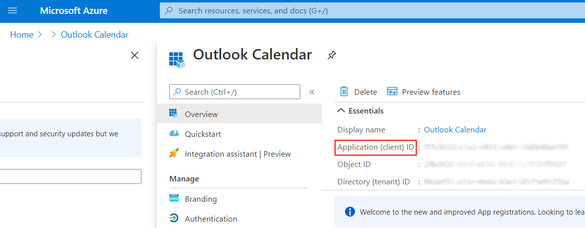
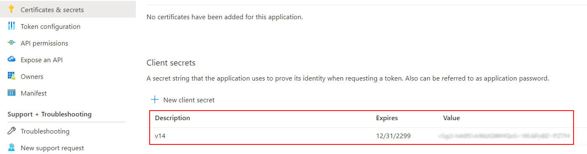

=====================================
Synchronization with Outlook Calendar
=====================================

Life is a lot easier when you are able to manage all your calendars in one single place. Therefore,
now Odoo also allows you to synchronize your Outlook Calendar with the Calendar application.

To start, `Register your application with the Microsoft identity platform
<https://docs.microsoft.com/en-us/azure/active-directory/develop/quickstart-register-app>`_ making
sure to **follow all the steps described in the guidelines**.

.. important::
   For the **Redirect URI restrictions**, copy your Odoo server URI followed by
   ``/microsoft_account/authentication``. Example:

   .. image:: media/redirect_URIs.png
      :align: center
      :alt: Odoo's server URI that is accepted when microsoft returns authentication

Once you are finished, copy:

- Client ID:

- Client Secrets:

Now, activate the *Outlook Calendar* feature in *Settings* and paste those key pieces of information.

.. image:: media/outlook_calendar.png
   :align: center
   :alt: Outlook Calendar feature activated in Odoo

.. _outlook_calendar/sync_with_outlook:

Next, go to *Calendar* and click on *Sync with Outlook*. Log in to your account and grant the
required permissions.

.. image:: media/sync_with_outlook.png
   :align: center
   :alt: Calendar view and the button Sync with Outlook in Odoo Calendar

Once synched, the synchronization happens seemingly and automatically, keeping you always up to date.

.. image:: media/synched_with_outlook.png
   :align: center
   :alt: View of Odoo's Calendar synched with Outlook's Calendar

.. note::
   All users that want to use the synchronization must :ref:`sync their calendar with Outlook
   <outlook_calendar/sync_with_outlook>`.